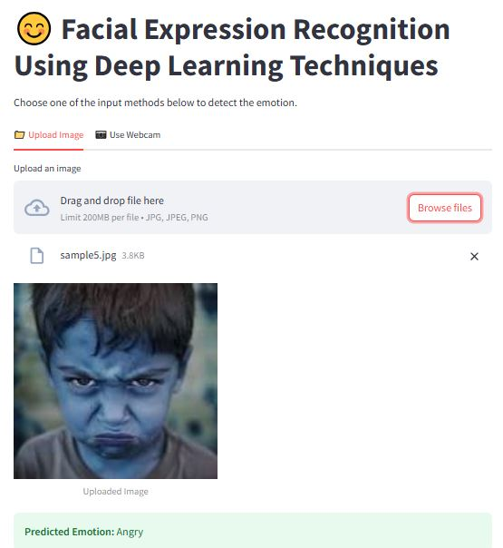

# Facial Expression Recognition using CNN

This project implements a deep learning model to classify human facial expressions into distinct emotions such as Angry, Happy, Sad, and others using TensorFlow and Keras. It includes image preprocessing, model training, and a Streamlit-based web application for real-time prediction.

## 🔍 Project Features

* Facial emotion classification using deep learning
* Trained on a large dataset of labeled emotion images
* Live emotion prediction via uploaded image
* Deployed using a user-friendly Streamlit interface
* Modular and easy-to-extend codebase

### Predicted Facial Expressions

#### Happy
**Input Image:**  
  
**Predicted Emotion:** 😄 Happy

#### Sad
**Input Image:**  
  
**Predicted Emotion:** 😢 Sad

#### Angry
**Input Image:**  
  
**Predicted Emotion:** 😠 Angry

> The model correctly classifies these facial expressions from real-world images.

> A Streamlit interface (`app.py`) is included to visually test the model with user-uploaded images.

## 📦 Dataset

The dataset used for training is not included in this repository due to size limitations.  
You can download it from [this Google Drive link](https://drive.google.com/file/d/14FJae0kO2hUztFr6BwjZCl2fqIMxNzJT/view) and place it in the `Facial_Images/` folder.

## Requirements

- Python 3.7+
- TensorFlow >= 2.6
- NumPy >= 1.19
- OpenCV (cv2) >= 4.5
- Streamlit >= 1.0
- Matplotlib >= 3.3
- scikit-learn (for evaluation metrics)
- seaborn (for visualization)

